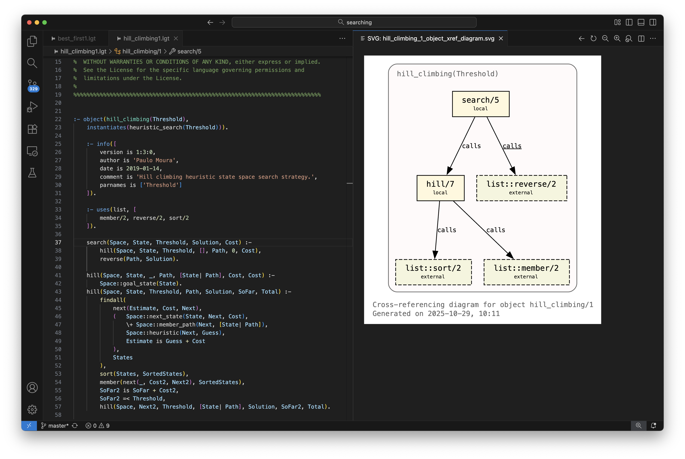
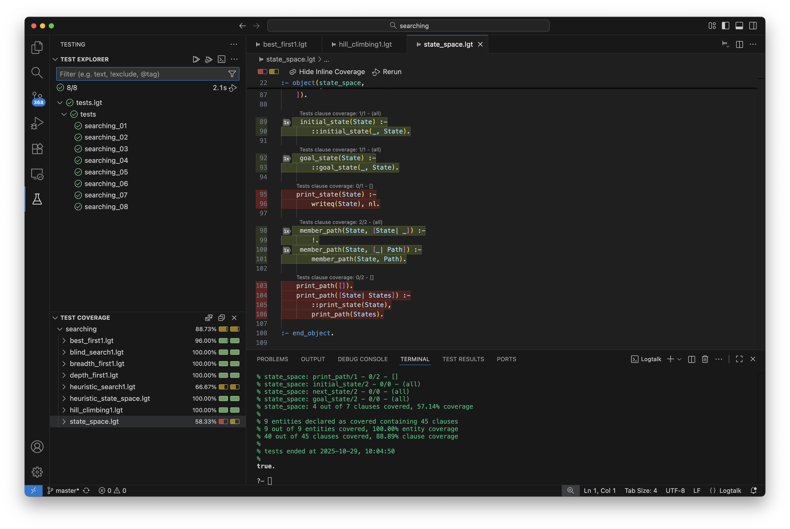
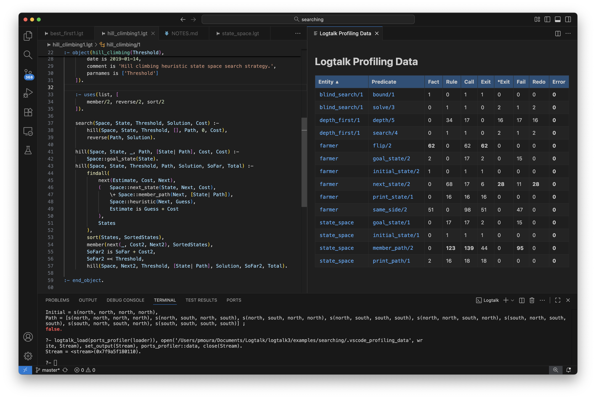

# Logtalk for VSCode

A VSCode extension that provides language support for Logtalk. Forked from the [original plugin](https://github.com/arthwang/vsc-logtalk) by Arthur Wang.

Requires Logtalk 3.97.0 or later and a supported [Prolog backend](https://logtalk.org/download.html#requirements). As this extension uses supporting code that's part of the Logtalk distribution, use of the latest Logtalk version is strongly recommended.

🙏 Sponsored by [Permion](https://permion.ai/) and [GitHub Sponsors](https://github.com/sponsors/pmoura).

---

[Installation](#installation) | [Features](#features) | [Configuration](#configuration) | [Known issues](#known-issues) | [Development](#development) | [Acknowledgements](#acknowledgements) | [Licence](#license)

---

## Installation

This extension can be installed directly from [VSCode](https://code.visualstudio.com/), from its [Marketplace](https://marketplace.visualstudio.com/items?itemName=LogtalkDotOrg.logtalk-for-vscode), or by [downloading](https://github.com/LogtalkDotOrg/logtalk-for-vscode/releases/latest) its `.vsix` file and selecting the "Extensions: Install from VSIX..." command from the command palette. It can also be installed directly from [VSCodium](https://vscodium.com/) or by downloading its `.vsix` file from its [Marketplace](https://marketplace.visualstudio.com/items?itemName=LogtalkDotOrg.logtalk-for-vscode). See [Development](#development) for details on how to generate the extension `.vsix` file for a git version.

This extension **must** be configured before it can be used. Notably, the following settings are required:

- Logtalk home path
- Logtalk user path
- Prolog backend

For details, see [Configuration](#configuration). This extension includes a walkthrough that can be accessed from the VSCode "Welcome" page after installing the extension. It can also be accessed from the command palette using the command "Welcome: Open Walkthrough...". The walkthrough guides you in configuring the extension and checking that basic functionality is working.

## Features

This extension provides a comprehensive set of features for Logtalk development:

- [Syntax highlighting](#syntax-highlighting)
- [Automatic indentation](#automatic-indentation)
- [Completions](#completions)
- [Snippets](#snippets)
- [Selection ranges](#selection-ranges)
- [Formatting support](#formatting-support)
- [Linter](#linter)
- [Commands](#commands)
- [Code Navigation](#code-navigation)
- [Refactoring support](#refactoring-support)
- [Debugging support](#debugging-support)
- [Testing support](#testing-support)
- [Profiling support](#profiling-support)
- [Hover contents](#hover-contents)
- [Chat Participant](#chat-participant)
- [File renaming and deletion propagation](#file-renaming-and-deletion-propagation)
- [Virtual workspaces support](#virtual-workspaces-support)

Most of the features rely on a Logtalk session running in the integrated terminal with VSCode support loaded. This session is automatically created when the extension is activated (by opening a Logtalk source file). This Logtalk session is functionally equivalent to a **portable** Language Server Protocol (LSP) server. You can also use this section for your own Logtalk queries. Alternatively, you can create a new terminal running a shell and call the backend integration script that you want to use.

### Syntax highlighting

This extension assumes that the Logtalk source files use either the `.lgt` or `.logtalk` extensions.

- Full syntax highlight for all Logtalk built-in control constructs, directives, methods, and predicates
- Full syntax highlight for all ISO Prolog standard built-in control constructs, directives, and predicates

To also use the syntax highlighting support with Prolog source files, open the VSCode settings, search for "files.associations", and add an entry for each Prolog extension you want to associate with Logtalk syntax highlighting.

### Automatic indentation

- Entity opening directives: increases indentation for multiline entity declarations (`:- object(...)`, `:- protocol(...)`, `:- category(...)`) after the first line
- Predicate and grammar rules: increases indentation after the `:-` and `-->` operators
- Term completion: automatically outdents and removes trailing whitespace after the period (`.`) that ends a term
- Control constructs: increases indentation after disjunction (`;`), if-then-else (`->`), and soft-cut (`*->`) operators when they appear at the start of a line; maintains current indentation after `->` and `*->` when they appear mid-line
- Brackets: automatically indents and outdents for opening brackets (`[`, `{`, `(`)
- Block comments: smart formatting for JavaDoc-style block comments (`/** ... */`) with automatic continuation of comment lines with `* ` prefix and proper indentation handling

### Completions

- Built-in directive, method, and predicate template auto-completion
- List tail variables after typing the `|` character based on the head variable name

### Snippets

The snippets for entity opening directives and predicate scope directives are all triggered by natural prefix, i.e. `:- public` triggers `:- public()` directive. You don't need to type all characters to show up the suggestion list. Relations between entities use choice snippets: `orel` triggers object relation choices and `crel` for category. There is only one relation between protocols, 'extends', so `ext` will trigger the snippet.

Refer to the table below for other snippets:

|    Prefix | Description                          |
| --------: | ------------------------------------ |
|    :- obj | Object                               |
|    :- cat | Category                             |
|    :- pro | Protocol                             |
|      orel | relations between objects(choice)    |
|      crel | relations between categories(choice) |
|       ext | relations between categories         |
|  category | Category with protocol               |
|  category | Category                             |
|     class | Class with all                       |
|     class | Class with category                  |
|     class | Class with metaclass                 |
|     class | Class with protocol                  |
|     class | Class                                |
|  category | Complementing category               |
|  category | Extended category                    |
|  protocol | Extended protocol                    |
|  instance | Instance with all                    |
|  instance | Instance with category               |
|  instance | Instance with protocol               |
|  instance | Instance                             |
|   private | (with no arguments)                  |
|   private | Private predicate                    |
| protected | (with no arguments)                  |
| protected | Protected predicate                  |
|  protocol | Protocol                             |
|    object | Prototype with all                   |
|    object | Prototype with category              |
|    object | Prototype with parent                |
|    object | Prototype with protocol              |
|    object | Prototype                            |
|    public | (with no arguments)                  |
|    public | Public predicate                     |

### Selection ranges

The "Expand Selection" command can be used to expand the selection to the next level using the hierarchy: word, line, comment or directive or clause or grammar rule, predicate or non-terminal definition, entity, file. The "Shrink Selection" command can be used to shrink the selection to the previous level.

### Formatting support

Experimental support for the "Format Document" and "Format Selection" commands is provided. The formatting rules follow the Logtalk [coding style guidelines](https://logtalk.org/coding_style_guidelines.html). Currently, the following formatting rules are supported:

- Space-to-tab conversion is performed using the editor's tab size setting
- Mixed indentation is handled by converting all spaces to tabs based on the tab size setting
- Consecutive empty lines are collapsed into a single empty line
- Entity opening and closing directives are formatted to start at column 0 with empty lines before and after
- Multiple entities in the same file are separated by two or more empty lines
- Entity opening directives are formatted to use multi-line layout when there are multiple relations
- Content inside entity opening and closing directives is indented by one tab
- Directives with list arguments are formatted to use multi-line syntax (depending on the `editor.rulers` and `editor.tabSize` settings)
- Documentation directives key values that are lists of pairs are formatted to use multi-line syntax (depending on the `editor.rulers` and `editor.tabSize` settings)
- Documentation directives key values that are lists of non-pair elements are formatted to use either single- or multi-line syntax (depending on the `editor.rulers` and `editor.tabSize` settings)
- An empty line is added if missing between declarations of different predicates/non-terminals
- An empty line is added if missing between definitions of different predicates/non-terminals
- A space is added if missing after the neck operator (`:-`) in directives
- A space is added if missing before the neck operator (`:-` or `-->`) in predicate/non-terminal rules
- Any comment or goal after the neck operator (`:-` or `-->`) is moved to the next line and indented
- Conditional compilation blocks are formatted by aligning conditional compilation directives according to their nesting level
- Line comments are indented if they start at character zero but are not followed by indented content
- Block comments content are indented when the comment delimiters are on separate lines; otherwise, the full block comment is indented

You can verify the changes before saving them using the "File: Compare Active File with Saved" command, which also allows selectively undoing formatting changes.

### Linter

- Errors/warnings when compiling source files are added to the "PROBLEMS" pane.
- Errors/warnings when compiling source files can also be navigated to from the Logtalk terminal via Ctrl+click (Windows, Linux, ...) or Cmd+click (macOS).

Quick fixes are provided for some errors and warnings. When applying quick fixes, notably those that delete and insert code, the _positions_ of the warnings and errors later in the file may not be updated, thus preventing further quick fixes to be applied or applied correctly. In this case, save your changes and re-run the linter by using the "Make - Reload" command (note that this command can be called automatically when saving a file using the `logtalk.make.onSave` setting).

### Commands

Most commands, notably those that run the developer tools, **require** the code to be loaded, typically by opening the project loader file and selecting the "Load File" context menu item. Alternatively, you can open one of the project source files and use the "Load Directory" context menu item. In the command palette, type "Logtalk" to list all the available commands.

#### Help command

The "Help: Logtalk Handbook" command opens the Logtalk Handbook (from the currently installed version) using [Live Preview](https://marketplace.visualstudio.com/items?itemName=ms-vscode.live-server) if installed, or the default browser otherwise. The Handbook includes a link to the APIs documentation.

Due to Live Preview limitations, the command adds the Logtalk documentation folder to the workspace if it's not already there (it can be removed at any time without any consequence to the Logtalk installation using the explorer context menu "Remove Folder from Workspace" command).

#### Project commands

Project (workspace) commands can be triggered from the command palette by typing 'Logtalk' in the input box to pop up the list of all commands of this extension. In the case of [multi-root workspaces](https://code.visualstudio.com/docs/editor/workspaces), when triggered from the command palette these commands use the first workspace root folder; when triggered from the explorer/context menu they use the workspace folder containing the selected file.

|                         Command | Description                                                        |
| ------------------------------: | :----------------------------------------------------------------- |
|                  Create Project | Creates a new project with renamed copies of the sample files      |
|                    Load Project | Loads the loader file found in the workspace root folder           |
|                    Open Logtalk | Opens Logtalk in an integrated terminal                            |
|                            Make | Sub-menu with available make targets                               |
|          Scan Project Dead Code | Recursively scans the workspace root folder for dead code          |
|         Compute Project Metrics | Recursively computes metrics for the workspace root folder         |
|                       Profiling | Sub-menu with code profiling commands                              |
|  Generate Project Documentation | Recursively generates documentation for the workspace root folder  |
|       Generate Project Diagrams | Recursively generates diagrams for the workspace root folder       |
|             Run Project Testers | Runs the `logtalk_tester` script from the workspace root folder    |
|             Run Project Doclets | Runs the `logtalk_doclet` script from the workspace root folder    |
|                         Jupyter | Sub-menu with Jupyter commands                                     |

The "Create Project" command is usually called from the command palette. It asks for the folder where to copy the renamed sample files.

The "Load Project" command looks for a `loader.lgt` or `loader.logtalk` file in the workspace root folder, printing a warning if no loader file is found.

The "Scan Project Dead Code", "Compute Project Metrics", "Generate Project Documentation", and "Generate Project Diagrams" commands require that the project code is already loaded. Quick fixes are provided for some of the documentation and dead code linter warnings.

The output of the "Run Project Testers" and "Run Project Doclets" commands is displayed in the "OUTPUT" pane "Logtalk Testers & Doclets" channel.

The output of the "Generate Project Documentation" and "Generate Project Diagrams" commands assume that the documentation and the diagrams will be browsed locally in VSCode (with the entry point being the main diagram, which can be opened using the "Open SVG in Viewer" command). The default output directories are `xml_docs` for documentation and `dot_dias` for diagrams. To generate documentation and diagrams for publication, define a _doclet_ and run it using the "Run Project Doclets" command.

The "Open Logtalk" command starts a Logtalk session in the integrated terminal and loads the VSCode support. This command is meant to be used when the Logtalk session created when the extension is activated (by opening a Logtalk source file) is accidentally closed (e.g., by a crash of the backend Prolog process). If you need a separate Logtalk session, create a new terminal running a shell and call the backend integration script that you want to use.

#### Directory and source file commands

These commands can be triggered from the editor/context menu via right-click in the editor area. These commands can also be triggered from the command palette assuming there's an active editor window.

|                 Command | Description                                                                      |
| ----------------------: | :------------------------------------------------------------------------------- |
|          Load Directory | Loads the current directory loader file into the Logtalk process                 |
|               Load File | Loads the active source file into the Logtalk process                            |
|        Open Parent File | Opens the file that loaded the active source file if any                         |
|                    Make | Sub-menu with available make targets                                             |
|          Scan Dead Code | Scans the active source file directory for dead code                             |
|         Compute Metrics | Computes metrics for all files in the active source file directory               |
|               Profiling | Sub-menu with code profiling commands                                            |
|  Generate Documentation | Generates documentation for the active source file directory                     |
|       Generate Diagrams | Generates diagrams for the active source file directory                          |
|               Run Tests | Loads the tester file under the active source file directory                     |
| Run Tests with Coverage | Loads the tester file under the active source file directory and report coverage |
|              Run Doclet | Loads the doclet file under the active source file directory                     |
|                 Jupyter | Sub-menu with Jupyter commands                                                   |
|         Toggle CodeLens | Toggles code lens of test results and cyclomatic complexity                      |

The "Load Directory" command looks for a `loader.lgt` or `loader.logtalk` file in the directory of the selected file, printing a warning if not found. The "Run Tests" command looks for a `tester.lgt` or `tester.logtalk` file in the directory of the selected file, printing a warning if not found. The "Run Doclet" command looks for a `doclet.lgt` or `doclet.logtalk` file in the directory of the selected file, printing a warning if not found.

The "Run Tests" and "Run Tests with Coverage" commands add failed tests to the "PROBLEMS" pane. Quick fixes are provided for some test definition warnings.

The "Generate Documentation" and "Scan Dead Code" commands add linter warnings to the "PROBLEMS" pane. Quick fixes are provided for some of the warnings.

The output of the "Generate Documentation" and "Generate Diagrams" commands assume that the documentation and the diagrams will be browsed locally in VSCode (with the entry point being the main diagram, which can be opened using the "Open SVG in Viewer" command). The default output directories are `xml_docs` for documentation and `dot_dias` for diagrams. To generate documentation and diagrams for publication, define a _doclet_ and run it using the "Run Doclet" command.

#### Jupyter commands

These commands are available from the "Jupyter" sub-menu and allow opening Logtalk source files and Markdown files as Jupyter notebooks, plus pairing and syncing notebook representations. They can be triggered from the explorer and editor context menus via right-click in the editor area or from the command palette.

|                               Command | Description                                                           |
| ------------------------------------: | :-------------------------------------------------------------------- |
|                    Open as a Notebook | Opens the selected source file or Markdown file as a notebook         |
|             Open as a Paired Notebook | Opens the selected source file or Markdown file as a paired notebook  |
|  Sync paired Notebook Representations | Sync the paired notebook and its text representation                  |

These commands are only available when [Jupytext](https://jupytext.readthedocs.io/en/latest/) 1.16.7 or a later version is installed. See also the "logtalk.jupytext.path" setting below. When selecting a Markdown file, the extension must be activated first by opening a Logtalk source file.

Paired notebooks allow synchronizing changes between the notebook and its text representation. The text representation is version control and code review friendly. The notebook representation is best for interactive development and testing. See the Jupytext documentation for more details.

#### Make commands

These commands are available from the "Make" sub-menu. They can be triggered from the explorer and editor context menus via right-click in the editor area or from the command palette.

|          Command | Description                                                |
| ---------------: | :--------------------------------------------------------- |
|    Make - Reload | Reload files that have been modified since last loaded     |
|   Make - Optimal | Recompile loaded files in optimal mode                     |
|    Make - Normal | Recompile loaded files in normal mode                      |
|     Make - Debug | Recompile loaded files in debug mode                       |
|     Make - Check | Checks for code issues in the loaded files                 |
|  Make - Circular | Checks for code circular dependencies in the loaded files  |
|     Make - Clean | Deletes all intermediate files generated by the compiler   |
|    Make - Caches | Deletes the dynamic binding caches                         |

#### Profiling commands

These commands are available from the "Profiling" sub-menu. They can be triggered from the explorer and editor context menus via right-click in the editor area or from the command palette.

|          Command | Description                                      |
| --------------------: | :------------------------------------------ |
|      Toggle Profiling | Toggles profiling on/off                    |
|   Show Profiling Data | Show profiling data in a webview            |
|  Reset Profiling Data | Reset profiling data and close the webview  |

The profiling webview allows navigating to the source file location of entities, predicates, and clauses. Note that collecting profiling data depends solely on the project loader file, which must allow recompilation of the source code in debug mode.

#### Diagram commands

|              Command | Description                              |
| -------------------: | :--------------------------------------- |
|  Open SVG in Viewer  | Open the selected SVG file in a webview  |

Right-click on a Logtalk diagram SVG file in the Explorer pane and select the "Open SVG in Viewer" context menu item to open the selected file in a webview. This webview provides navigation and link handling with zoom and reload controls. Links to other SVG files and HTML documentation files open in the same viewer. This assumes that the commands that generate the diagrams and documentation were used with their default output directories (respectively, `dot_dias` and `xml_docs`). The top diagrams are the directory diagrams (that are linked to file diagrams, which are linked to entity diagrams, which are linked to predicate and non-terminal cross-referencing diagrams).

#### Chat participant commands

These commands are only available from the command palette. They testing and refreshing the documentation cache used by the chat participant.

|                      Command | Description                            |
| ---------------------------: | :------------------------------------- |
|  Test Documentation Cache    | Test the documentation caching system  |
|  Refresh Documentation Cache | Refresh the documentation cache        |

#### Extension logging commands

These commands are only available from the command palette. They are meant for helping with debugging and troubleshooting the extension.

|                      Command | Description                            |
| ---------------------------: | :------------------------------------- |
|  Set Extension Logging Level | Interactive log level configuration    |
|  Show Extension Log          | Display the extension's output channel |

### Code Navigation

Code navigation features **require** the code to be loaded, typically by using the "Load Project" command or by opening the project loader file and using the "Load File" command from the editor/context menu. Additionally, code must be compiled with the `source_data` flag set to `on` (default) and the `context_switching_calls` set to `allow` (default).

#### Go to Declaration

Right-click on a predicate (or non-terminal) name and select the "Go to Declaration" context menu item to go to the predicate (or non-terminal) scope directive.

#### Go to Definition

Right-click on a predicate (or non-terminal) name in a goal or predicate directive and select the "Go to Definition" context menu item to go to the first clause defining the predicate. Note that some definitions may only be resolved at runtime (e.g., in a message to _self_ goal or when dynamic predicates are used). When a definition is not found, try in alternative to go to the declaration and then to the implementations.

#### Go to Type Definition

Entities (objects, protocols, and categories) are interpreted as types. Right-click on an entity name and select the "Go to Type Definition" context menu item to go to the entity opening directive.

#### Go to References

Right-click on a predicate (or non-terminal) name in a scope directive, `alias/2` directive, `uses/2` directive, `synchronized/1` directive, fact, rule head, or goal and select the "Go to References" or "Find All References" context menu items. References are interpreted here as messages, super calls, and predicate calls. For dynamic predicates, references include asserting or retracting clauses for them. Note that recursive calls, predicate declarations, and predicate definitions are not interpreted as references.

Right-click on an entity name in an entity opening directive to find references to it in other entity opening directives (i.e., entities in an implementing, importing, complementing, extending, instantiating, or specializing relation with the selected entity), `alias/2` directives, `uses/1-2` directives, and multifile predicate clauses. In the case of an object, this also finds explicit messages to the object. Note that you can go to an entity opening directive by right-clicking in an entity name and selecting the "Go to Type Definition" context menu item.

#### Go to Implementations

Right-click on a predicate (or non-terminal) name in a scope directive and select the "Go to Implementations" or "Find All Implementations" context menu items. Note that you can go to a predicate scope directive by right-clicking in the predicate name in a goal and selecting the "Go to Declaration" context menu item.

Right-click on a protocol name in its entity opening directive to find implementations of the protocol. Note that you can go to an entity opening directive by right-clicking in an entity name and selecting the "Go to Type Definition" context menu item.

#### Go to Symbol in Editor...

Symbols include entity identifiers in entity opening directives, predicate (and non-terminal) indicators in predicate scope directives, first predicate clause, and first non-terminal rule. Note that VSCode doesn't support customization of symbol kind names and icons, thus forcing adapting the pre-defined names and icons. This feature doesn't require the code to be loaded.

#### Go to Symbol in Workspace...

Symbols include entity identifiers in entity opening directives, predicate (and non-terminal) indicators in predicate scope directives, first predicate clause, and first non-terminal rule. Note that VSCode doesn't support customization of symbol kind names and icons, thus forcing adapting the pre-defined names and icons. This feature doesn't require the code to be loaded.

#### Show Call Hierarchy

Right-click on a predicate (or non-terminal) name in a goal or in a clause head and select the "Show Call Hierarchy" context menu item to browse callers and callees of the selected predicate (or non-terminal). Note that callers and callees that can only be resolved at runtime (e.g., in a message to _self_ goal or when dynamic predicates are used) may not be returned.

#### Show Type Hierarchy

Right-click on an entity name and select the "Show Type Hierarchy" context menu item to browse ancestors and descendants of the selected entity. Here, ancestor is interpreted as any entity from which the selected entity inherits, and descendant is interpreted as any entity that inherits from the selected entity.

### Refactoring support

Several refactoring operations are supported. Users should commit their work before using this feature and preview the changes (when available) before applying them (see also the `files.refactoring.autoSave` setting). After, the "Make - Reload" and "Make - Check" commands can be used to verify the changes before committing them. Due to VSCode limitations, refactoring operations that require user input cannot be previewed. But the files changed are opened in the editor and the user can verify the changes before saving them (using e.g. the "File: Compare Active File with Saved" command, which also allow selectively undoing refactoring changes). Note that most refactoring operations require the code to be loaded.

When a refactoring results in changes to multiple files, use the "Save All" command to save all modified files so that a single "Make - Reload" command can be used to reload the modified code. Note that this command can be called automatically when saving files using the `logtalk.make.onSave` setting.

#### Increment and decrement numbered variables

The "Increment numbered variables" and "Decrement numbered variables" refactoring operations are available when the user right-clicks on a variable ending with a number in a predicate rule or in a grammar rule and uses the "Refactor" context menu items or the "Refactor" command palette items. These refactorings increment or decrement all variables with the same prefix and a number equal or greater than the selected variable number in the rule. The selected variable can be anywhere in the rule (e.g., in the head, in the body, or in a comment).

#### Variable inlining and variable introduction

An "Inline variable" refactoring operation is available when the user selects a unification goal in a rule body and uses the "Refactor" context menu item or the "Refactor" command palette item. The refactoring replaces all occurrences of the variable in the rule with its unified term. The unification goal should be the only goal in the line.

A "Unify with new variable" refactoring operation is available when the user selects a complete term in a predicate rule or in a grammar rule (e.g., a head argument) and uses the "Refactor" context menu item or the "Refactor" command palette item. The refactoring asks the user for the name of the new variable, replaces the selected term with the new variable, and adds a unification goal to the rule body (after the rule head when the term is a head argument, before the line of the selected term otherwise).

#### Code extraction

A "Replace magic number with predicate call" refactoring operation is available when the user selects a number in a rule body and uses the "Refactor" context menu item or the "Refactor" command palette item. The user is asked to enter the name of the predicate to be created and its scope. The predicate is created with the number as its single argument and added to the entity. The selected number is replaced with a variable derived from the predicate name and the rule body is updated with a call to the new predicate inserted after the clause head (note that when compiling the code in optimal mode, the call to the new predicate is inlined).

An "Extract predicate/non-terminal" refactoring operation is available when the user selects one ot more lines of code with complete goals in a predicate rule or in a grammar rule and uses the "Refactor" context menu item or the "Refactor" command palette item. The refactoring asks the user for the name of the new predicate (or non-terminal) and adds it after all clauses of the current predicate (or non-terminal). The selected code is replaced with a call to the new predicate (or non-terminal).

An "Extract protocol" refactoring operation is available when the user right-clicks on an object or category name in their opening entity directive and uses the "Refactor" context menu item or the "Refactor" command palette item. This refactoring is only available when the entity contains at least one predicate scope directive. The name of the protocol is derived from the name of the selected entity. The user is asked to confirm the file name and file location. The extracted code includes all predicate declarations for the selected entity. The extracted code is always copied verbatim, with no changes to the indentation or whitespace.

Four other code extraction refactoring operations are supported when the user selects one or more complete terms (or comments) and uses the "Refactor" context menu item or the "Refactor" command palette item:

- "Extract to Logtalk entity" (the user is asked to select the target entity)
- "Extract to new Logtalk entity" (the user is asked to select the entity type, entity name, file name, and file location)
- "Extract to new Logtalk file" (the user is asked to select the file name and file location)

#### Resolving and introducing include/1 directives

When the user selects a region of code that contains an `include/1` directive, the "Refactor" context menu item or the "Refactor" command palette item provides a "Replace include/1 directive with file contents" action. The included file is resolved if it's a relative or absolute path, with or without a common Logtalk or Prolog extension. The included file contents are indented to match the indentation of the `include/1` directive.

The "Replace with include/1 directive" refactoring operation is available when the user selects a region of code and uses the "Refactor" context menu item or the "Refactor" command palette item. The user is asked to select the new file name and file location. The selected code is extracted to the new file and the selection is replaced with an `include/1` directive.

#### Symbol renaming

Entity, predicate, non-terminal, and variable rename support is available:

- Entities (objects, categories, or protocols): right-click on the entity name and use the "Go to Type Definition" context menu item to go to the entity opening directive. Then, right-click on the entity name and select the "Rename Symbol" context menu item.
- Predicates (or non-terminals): right-click on the predicate (or non-terminal) name in a predicate directive, fact, rule head, or goal and select the "Rename Symbol" context menu item.
- Variables (within the scope of a clause, grammar rule, or directive): right-click on the variable name and select the "Rename Symbol" context menu item.
- Parameter variables (within the scope of an entity): right-click on the parameter variable name in the entity opening directive and select the "Rename Symbol" context menu item.

#### Entity parameters refactoring

To add a new parameter to an object (or category), right-click on the object (or category) name in its opening directive and select the "Add parameter to object/category" context menu item. To reorder the parameters of an object (or category), right-click on the object (or category) name in its opening directive and select the "Reorder object/category parameters" context menu item. To remove a parameter from an object (or category), right-click on the object (or category) name in its opening directive and select the "Remove parameter from object/category" context menu item. New parameters must use _parameter variable syntax_ (i.e., `_VariableName_`).

#### Predicate and non-terminal argument refactoring

To add a new argument to a predicate (or non-terminal), right-click on the predicate name in a directive, goal, or clause head and select the "Add argument to predicate/non-terminal" context menu item and enter the new argument name and position. To reorder the arguments of a predicate (or non-terminal), right-click on the predicate name in a directive, goal, or clause head and select the "Reorder predicate/non-terminal arguments" context menu item and enter the new argument order. To remove an argument from a predicate (or non-terminal), right-click on the predicate name in a directive, goal, or clause head and select the "Remove argument from predicate/non-terminal" context menu item and enter the argument position.

#### Add predicate/non-terminal declaration

To add a declaration for a local predicate (or non-terminal), right-click on the predicate name in a clause head and select the "Add predicate/non-terminal declaration" context menu item. The declaration, consisting of scope, `mode/2`, and `info/2` directives, is added before the predicate definition.

#### Directive refactoring

The "Split in individual directives" refactoring operation is available when the user right-clicks on the directive name in a predicate directive with a list argument. The directive is split into individual directives, one for each element in the list.

The "Sort predicates/non-terminals" refactoring operation is available when the user right-clicks on the directive name in a predicate directive with a list argument. The list is sorted alphabetically. Single line directives are kept as single line. Multi-line directives are formatted after sorting using the same code as the "Format Selection" command. For directives defining aliases (using the `as` operator), the sorting is based on the original predicate/non-terminal name (the left operand of the `as` operator).

#### Converting between object, protocol, and category entity types

Right-click on an entity name in its opening directive and select the "Convert ... to object", "Convert ... to protocol", or "Convert ... to category" context menu items. The applicability of these operations depends on the entity type and its opening directive arguments. Note that the entity name is not changed and further edits may be required to the entity code after the conversion to make it valid (for example, removing predicate definitions that are not allowed in a protocol).

#### Converting a Prolog module to an object

Right-click on a module name in its opening directive and select the "Convert module to object" context menu item. The module is converted to an object by replacing the module directive with an object opening directive. Any predicates exported from the module directive are declared as public predicates. Any existing `export/1` directives are replaced by `public/1` directives. Any existing `reexport/2` directives are replaced with `uses/2` directives.

Note that this conversion is always partial as several decisions are required by the user that cannot be automated.

#### Wrapping file contents as an object

Right-click anywhere in a file that has no entity or module opening directives and select the "Wrap file contents as an object" context menu item. The file contents are wrapped with object opening and closing directives. The object name is derived from the file name. This refactoring is useful when converting plain Prolog files to Logtalk.

#### Inferring public predicates

Right-click on an object or category name in its opening directive and select the "Infer public predicates" context menu item. The file must be loaded. The public predicates are inferred from the entity's implementation and a `public/1` directive is added with the inferred predicates. This refactoring is only available for objects and categories with no `public/1` directives. It's typically used after converting a plain Prolog file to a Logtalk object using the "Wrap file contents as an object" refactoring.

#### Sorting files by dependencies

Right-click on the predicate name in a `logtalk_load/1-2` call with a list of atoms in the first argument and select the "Sort files by dependencies" context menu item. The file list is sorted based on the dependencies between the files. The files must be loaded prior to applying this refactoring. This refactoring is useful when porting Prolog code to Logtalk, notably when using the `wrapper` tool (which generates a first version of a `loader.lgt` file for the ported code).

#### Known refactoring issues

- Some refactoring operations may not be complete, notably due to the use of dynamic binding or meta-predicate features.
- In some cases, refactoring operations may be made available when the user selection doesn't qualify for the operation.
- When saving all files modified by a refactoring operation using the "Save All" command, the saving order may result in loading warnings.

### Debugging support

The `debugger` tool is automatically loaded when using the "Run > Start Debugging" and "Run > Run Without Debugging" commands, when setting spy points using the "Run" menu breakpoint items, and when using the "Make - Debug" command to recompile the code in debug mode.

The "Run > Start Debugging" command recompiles loaded code in debug mode, sends the `debug/0` message to the `debugger` tool, and re-adds the defined breakpoints and log points (that were set using the VSCode GUI).

The "Run > Stop Debugging" command recompiles loaded code in normal mode, sends the `nodebug/0` message to the `debugger` tool, and removes the defined breakpoints and log points (that were set using the VSCode GUI).

The "Run > Run Without Debugging" command sends the `nodebug/0` message to the `debugger` tool without affecting any defined breakpoints and log points.

The "Run > Restart Debugging" command recompiles modified files, recompiles loaded code in debug mode, sends the `debug/0` message to the `debugger` tool, and re-adds the defined breakpoints and log points (that were set using the VSCode GUI). Note that breakpoints and log points may need to be redefined due the changes in modified files.

To trace execution you must either use the debug toolbar buttons or send the `trace/0` and `notrace/0` messages to the `debugger` tool from the integrated terminal. See the documentation of the `debugger` tool for details.

When debugging in the integrated terminal using the `debugger` tool, the current clause (at leashed unification ports) is shown in the active editor window. The VSCode debug toolbar buttons are supported and extended with additional buttons for common port commands. For other port commands, you must type the command in the integrated terminal.

Breakpoints and log points can be added and removed using the "Run" menu breakpoint items. Clicking at the left of a line number in an editor window, in the same line as a clause head, creates a clause breakpoint represented by a red dot. Control-clicking in this red dot allows the breakpoint to be removed, edited, or disabled. But, although VSCode supports it, a Logtalk breakpoint cannot be a combination of log point and different types of breakpoints. If you edit a breakpoint, you must keep its singular type.

Function breakpoints are interpreted as predicate (or non-terminal) spy points by entering a predicate indicator (or a non-terminal indicator) or as context spy points by entering a `(Sender, This, Self, Goal)` tuple. Inline breakpoints are interpreted as clause breakpoints (note that they can only be set for clause heads). VSCode hit count breakpoints are interpreted as clause head successful unification count expressions. VSCode "Run" menu "New Breakpoint" > "Triggered Breakpoint..." item is not supported (as VSCode doesn't make available the data to extensions). But triggered breakpoints can still be set by creating conditional breakpoints where the expression is a `Entity-Line` term. For details on hit count expressions and conditional expressions, see the Logtalk Handbook section on debugging.

Changes to spy points via user-typed queries in the integrated terminal are not reflected in the VSCode display of current breakpoints. A particular case is when, at a leashed port, you enter the `n` command to turn off debugging: a quick way to restore all the breakpoints still defined using the VSCode GUI is to select the "Run" menu "Disable All Breakpoints" followed by "Enable All Breakpoints".

VSCode usability issues that affect debugging support:

- VSCode "Run" menu "New Breakpoint" > "Triggered Breakpoint..." item doesn't make the data available to language extensions. See above for the workaround.
- VScode "Toggle Activate Breakpoints" button in the "Run and Debug" pane doesn't generate an event that can be handled by extensions.
- VSCode doesn't support disabling menu items that are not supported by language extensions.
- When the "Run and Debug" pane is closed, selecting the "Run" menu "New Breakpoint > Function Breakpoint..." item doesn't open the pane to show the new breakpoint text insertion box.
- The "Variables", "Watch", and "Call Stack" panes in the "Run and Debug" sidebar are currently not supported. VSCode doesn't allow extensions to hide these built-in debug views. Users can right-click on the sidebar header and uncheck these panes to hide them manually.

### Testing support

Support for the VSCode Testing API is provided. This allows browsing and running tests from the "Testing" pane. After running the "Run Tests" or "Run Tests with Coverage" commands at least once, the "Testing" pane shows all the test results. Alternatively, you can also click in the "Run Tests" or "Run Tests with Coverage" buttons at the top of the "Testing" pane. You can then run individual tests or groups of tests from the "Testing" pane by clicking on the play button next to a test, a test object, or a test file. You can also navigate to a test by clicking its name. In the "Testing" and "Tests Results" panes, you can also use the "Rerun Last Run" button to re-run the last test run.

When available, code coverage information is also shown in the covered source files. Note that coverage data is per predicate and per predicate clause (or per non-terminal and per non-terminal rule), not per goal. Clauses used by the tests will be marked using a green color overlay in the editor gutter while clauses not used by the tests will be marked using a red color overlay. Use the editor window "Toggle Inline Coverage" button to toggle the coverage overlay. In the "Testing" pane, the "Test Coverage" sub-pane shows both statement (clauses) and function (predicates) coverage numbers and percentages (note that VSCode doesn't support renaming these terms). In the "Explorer" pane, the colored bar to the right of a file name indicates the combined percentage of covered clauses and predicates. Hovering over the bar shows the separate coverage details.

In the "Testing" pane, a warning triangle emoji (⚠️) is shown after the test name when the test is declared as flaky. You can navigate to the test by clicking its name or using the "Go to Test" context menu item. For directory, file, and object items, the "Go to Test" context menu item allows you to navigate to, respectively, the tests driver file, the tests file, and the object in the tests file.

Note that collecting code coverage data depends solely on the tests driver file. The option between running tests with or without coverage is only used to decide if any collected coverage data should be displayed.

### Profiling support

Support for profiling is provided. This allows browsing and analyzing profiling data from the "Profiling" sub-menu in the explorer and editor context menus. After running the "Toggle Profiling" command, loaded code is recompiled in debug mode and profiling is enabled. The "Show Profiling Data" command can be used to show the profiling data in a webview. The webview allows navigating to the source file location of entities, predicates, and clauses. It also allows saving the profiling data as a CSV file. Collected profiling data can be reset using the "Reset Profiling Data" command. The profiling commands are also available from the command palette. See the documentation of the `ports_profiler` tool for details and hints on how to interpret profiling data.

When editing a Logtalk file, the status bar shows a `$(pulse) Profiling: on/off` item. Clicking on this item toggles profiling. This status bar item is hidden when editing a non-Logtalk file.

### Hover contents

Hover contents is provided for built-in directives, built-in predicates, and built-in methods.

### Chat Participant

**Experimental.** The `@logtalk` chat participant provides intelligent assistance for Logtalk programming questions using VSCode's integrated Chat view. It combines documentation search with LLM-powered responses to help you learn and use Logtalk effectively. It uses the currently selected language model from the Copilot chat interface. It works best with recent models. Be aware that LLMs can and will generate incorrect or nonsensical answers.

**Requirements:**

- VSCode 1.90.0 or later
- GitHub Copilot extension installed and authenticated
- Configured Logtalk installation (for documentation access)
- [Context7 MCP server](https://github.com/upstash/context7) installed and running (for examples and documentation; optional)

**Usage:**

Type `@logtalk` in the Chat view followed by your question. The chat participant supports several slash commands for specific types of queries:

|       Command | Description                                       |
| ------------: | :------------------------------------------------ |
|   `/handbook` | Search the Logtalk Handbook documentation         |
|       `/apis` | Search the Logtalk APIs documentation             |
|   `/examples` | Get help with Logtalk code examples and patterns  |
|       `/docs` | Get help with documenting code                    |
|      `/tests` | Get help with writing and running tests           |
|  `/workspace` | Search project-specific documentation             |

The `/handbook`, `/apis`, and `/examples` slash commands work best with keywords. For example, `/examples threaded engines` is better than `/examples How to use multi-threading with engines`.

The `/docs` slash command uses the "Documenting" section from the Logtalk Handbook and the `lgtdocp` protocol documentation from the APIs as context to answer questions about documenting Logtalk code.

The `/tests` slash command uses the `lgtunit` testing tool documentation from the Logtalk Handbook and APIs as context to answer questions about writing and running tests.

For the `/workspace` slash command, the documentation assumes a `xml_docs` folder at the root of the workspace (or at the root of any workspace folder in multi-root workspaces) containing HTML or Markdown files (which can be generated using the "Generate Project Documentation" or "Generate Documentation" commands). This slash command works best with entities and predicates names or with keywords found in their descriptions.

**Examples:**

- `@logtalk How do I define a simple object?`
- `@logtalk /handbook object relations`
- `@logtalk /apis length/2`
- `@logtalk /examples recursive predicates`
- `@logtalk /workspace print state`
- `@logtalk /tests How do I write a simple unit test?`
- `@logtalk /tests What assertions are available in lgtunit?`
- `@logtalk /tests How do I run tests for my project?`
- `@logtalk /docs How do I document a predicate?`
- `@logtalk /docs What info/2 keys are available?`
- `@logtalk /docs How do I generate HTML documentation?`

**Features:**

- **Intelligent Documentation Search**: Automatically searches the official Logtalk Handbook and APIs documentation
- **RAG Integration**: Combines documentation context with AI responses for accurate, up-to-date information
- **Version-Aware Caching**: Documentation cache automatically updates when your Logtalk version changes
- **Contextual Follow-ups**: Provides relevant follow-up suggestions based on your queries
- **Graceful Fallbacks**: Works even when the language model is unavailable by showing documentation search results

The chat participant automatically detects your Logtalk version from `$LOGTALKHOME/VERSION.txt` and fetches the corresponding documentation from the Logtalk website. Documentation is cached locally and only refreshed when the version changes, ensuring fast responses while staying current.

### File renaming and deletion propagation

Renaming and deletion of Logtalk source files is propagated to `loader.lgt`, `loader.logtalk`, `tester.lgt`, and `tester.logtalk` files in the same directory. The propagation is done using a preview dialog to allow the user to review the changes before applying them.

Note that if the user selects "Cancel" in the preview dialog, the file will still be renamed or deleted but the propagation changes will not be applied. This is due to a limitation in the VS Code API. But the uer can always focus on the "Explorer" pane and undo the rename or deletion operation.

### Virtual workspaces support

Virtual workspaces support is limited as the extension is fundamentally designed for local development with a local Logtalk installation. Only basic language features such as syntax highlighting, symbol navigation, and document formatting work in virtual workspaces. Assuming a local Logtalk installation is available, you can start a Logtalk process by running the "Open Logtalk" command. But this process will not be able to load files from the virtual workspace.

## Configuration

The user can configure settings via the VSCode menu `Settings`. Entering `Logtalk` in the input box will show the Logtalk settings. Follows a description of all the settings in this extension with their default values (if any). On Windows, PowerShell 7.3.x or later must also be installed.

Settings are divided between _required_ and _optional_ settings. If you're migrating from an old version of this extension, you may need to delete the old settings (from the `settings.json` file) if you want to use only the defaults provided by the required settings.

### Required settings

#### Logtalk home and user paths

    "logtalk.home.path": ""
    "logtalk.user.path": ""

No defaults (VSCode doesn't support using environment variables to define settings). Must be set to the `LOGTALKHOME` and `LOGTALKUSER` environment variable **absolute path** values. On Windows, also use forward slashes (e.g., `C:/Program Files (x86)/Logtalk`).

#### Prolog backend

    "logtalk.backend": ""

No default. Possible values are `b`, `ciao`, `cx`, `eclipse`, `gnu`, `sicstus`, `swi`, `tau`, `trealla`, `xsb`, `xvm`, and `yap`. Ensure that the backend you want to use is installed. See also the [Known issues](#known-issues) section for limitations when using some of these backends.

### Optional settings

In most cases, the required settings are enough for full extension functionality. But they assume default installations for Logtalk and the Prolog backends. On Windows, they also assume the default installation of PowerShell 7. When that's not the case, the optional settings listed below allow **overriding** the defaults that are derived from the required settings.

On Windows, use forward slashes in settings that require paths. Use the `where.exe` command to find the absolute path for the required scripts.

On a POSIX system (e.g., macOS or Linux), use the `which` command to find the absolute path for the integration and tool scripts. If you're running Logtalk from a clone of its git repo, you may need to add the `.sh` extension to all scripts in the settings.

For settings that specify scripts, see their [man pages](https://logtalk.org/documentation.html#man-pages) for their available options.

#### Logtalk executable

    "logtalk.executable.path": ""
    "logtalk.executable.arguments": [ ]

Absolute path to the Logtalk executable or integration script and its arguments. The `logtalk.executable.arguments` setting supports two formats:

1. A simple array of arguments that applies to all backends (legacy array format for backwards compatibility).
2. An object where keys are backend identifiers and values are arrays of backend-specific arguments.

On POSIX systems (e.g., macOS or Linux), the `logtalk` executable can be created by running the `logtalk_backend_select` script. In alternative, set the integration script you want to use.

Example using the legacy array format (assuming a POSIX system, using SWI-Prolog as the backend, with the integration scripts installed at `/usr/local/bin`):

    "logtalk.executable.path": "/usr/local/bin/swilgt"
    "logtalk.executable.arguments": [ "-q" ]

Example using the dictionary format for multiple backends (assuming a POSIX system with integration scripts installed at `/usr/local/bin`):

    "logtalk.executable.path": ""
    "logtalk.executable.arguments": {
        "swi": [ "-q" ],
        "gnu": [ "--quiet" ],
        "sicstus": [ "--nologo" ]
    }

On Windows systems, use the absolute path to the PowerShell 7 executable and set the arguments to load the Logtalk integration script. For example (assuming the default Logtalk installation) and using SWI-Prolog as the backend:

    "logtalk.executable.path": "C:/Program Files/PowerShell/7/pwsh.exe"
    "logtalk.executable.arguments": [ "-file", "C:/Windows/swilgt.ps1" ]

Example using the dictionary format on Windows for multiple backends:

    "logtalk.executable.path": "C:/Program Files/PowerShell/7/pwsh.exe"
    "logtalk.executable.arguments": {
        "swi": [ "-file", "C:/Windows/swilgt.ps1", "-q" ],
        "gnu": [ "-file", "C:/Windows/gplgt.ps1", "--quiet" ],
        "sicstus": [ "-file", "C:/Windows/sicstuslgt.ps1", "--nologo" ]
    }

#### Logtalk project testers

    "logtalk.tester.script": ""
    "logtalk.tester.arguments": [ ]

Absolute path to the `logtalk_tester` automation script and its arguments, which **must** include at least the `-p` option specifying the Prolog backend. For example, assuming a POSIX system (e.g., macOS or Linux), using SWI-Prolog as the backend, with the scripts installed at `/usr/local/bin`:

    "logtalk.tester.script": "/usr/local/bin/logtalk_tester"
    "logtalk.tester.arguments": [ "-p", "swi" ]

On Windows systems, these settings must be set differently. For example (assuming the default Logtalk installation) and using SWI-Prolog as the backend:

    "logtalk.tester.script": "C:/Program Files/PowerShell/7/pwsh.exe"
    "logtalk.tester.arguments": [
        "-file", "C:/Windows/logtalk_tester.ps1", "-p", "swi"
    ]

The "logtalk.tester.arguments" setting is only used when the "logtalk.tester.script" setting is not the empty string. By default, the path to the `logtalk_tester` script is based on the "logtalk.home.path" setting and its arguments are based on the "logtalk.backend" setting plus the `-f xunit -s ''` arguments.

#### Logtalk project doclets

    "logtalk.doclet.script": ""
    "logtalk.doclet.arguments": [ ]

Absolute path to the `logtalk_doclet` automation script and its arguments, which **must** include at least the `-p` option specifying the Prolog backend. For example, assuming a POSIX system (e.g., macOS or Linux), using SWI-Prolog as the backend, with the integration scripts installed at `/usr/local/bin`:

    "logtalk.doclet.script": "/usr/local/bin/logtalk_doclet"
    "logtalk.doclet.arguments": [ "-p", "swi" ]

On Windows systems, these settings must be set differently. For example (assuming the default Logtalk installation) and using SWI-Prolog as the backend:

    "logtalk.doclet.script": "C:/Program Files/PowerShell/7/pwsh.exe"
    "logtalk.doclet.arguments": [
        "-file", "C:/Windows/logtalk_doclet.ps1", "-p", "swi"
    ]

The "logtalk.doclet.arguments" setting is only used when the "logtalk.doclet.script" setting is not the empty string. By default, the path to the `logtalk_doclet` script is based on the "logtalk.home.path" setting and its arguments are based on the "logtalk.backend" setting.

#### Logtalk project documentation

    "logtalk.documentation.script": ""
    "logtalk.documentation.arguments": [ ]

Absolute path to the documentation script and its arguments for converting the XML files generated by the Logtalk `lgtdoc` tool to their final format. For example, assuming a POSIX system (e.g., macOS or Linux) with the scripts available from `/usr/local/bin`:

    "logtalk.documentation.script": "/usr/local/bin/lgt2html"
    "logtalk.documentation.arguments": [ "-t", "APIs documentation" ]

On Windows systems, these settings must be set differently. For example (assuming the default Logtalk installation):

    "logtalk.documentation.script": "C:/Program Files/PowerShell/7/pwsh.exe"
    "logtalk.documentation.arguments": [
        "-file", "C:/Windows/lgt2html.ps1", "-t", "APIs documentation"
    ]

The "logtalk.documentation.arguments" setting is only used when the "logtalk.documentation.script" setting is not the empty string. By default, the path to the `lgt2html` script is based on the "logtalk.home.path" setting and its arguments are `-t "APIs documentation"`.

#### Logtalk project diagrams

    "logtalk.diagrams.script": ""
    "logtalk.diagrams.arguments": [ ]

Absolute path to the script for converting the `.d2` and `.dot` files generated (by default) by the Logtalk `diagrams` tool to their final format (by default, SVG). For example, assuming a POSIX system (e.g., macOS or Linux) with the scripts available from `/usr/local/bin`:

    "logtalk.documentation.script": "/usr/local/bin/lgt2svg"
    "logtalk.documentation.arguments": [ ]

On Windows systems, these settings must be set differently. For example (assuming the default Logtalk installation):

    "logtalk.diagrams.script": "C:/Program Files/PowerShell/7/pwsh.exe"
    "logtalk.diagrams.arguments": [ "-file", "C:/Windows/lgt2svg.ps1" ]

Diagrams script for converting the `.d2` and `.dot` files generated by the Logtalk `diagrams` tool. Requires d2 and Graphviz.

The "logtalk.diagrams.arguments" setting is only used when the "logtalk.diagrams.script" setting is not the empty string. By default, the path to the `lgt2svg` script is based on the "logtalk.home.path" setting, called without arguments.

#### Load project on activation

    "logtalk.loadProject.onActivation": false

Load project on extension activation. Although the default value is `false` (for backward compatibility), it's recommended to enable this feature for a better development experience as several extension features require the code to be loaded. This assumes that a `loader.lgt` or `loader.logtalk` file exists in the workspace root folder. In the case of multi-root workspaces, the project is loaded from the workspace folder containing the active editor's document.

#### Run Logtalk make on save

    "logtalk.make.onSave": false

Automatically call the "Make - Reload" command when saving a Logtalk source file. Although the default value is `false` (for backward compatibility), it's recommended to enable this feature for a better development experience.

#### Code metrics and test results code lens

    "logtalk.enableCodeLens": true

Enables displaying inline test results (including code coverage when collected) using code lens in both the test object and the tested entity source files opened in the editor. It also enables displaying inline entity cyclomatic complexity after computing code metrics. The tests and metrics data is persistent and can be updated by re-running tests and re-computing metrics (e.g., by simply clicking in the inline data). This setting can be toggled using the "Toggle CodeLens" command.

When editing a Logtalk file, the status bar shows a `$(info) CodeLens: on/off` item. Clicking on this item toggles CodeLens. This status bar item is hidden when editing a non-Logtalk file.

#### Diagrams file format

    "logtalk.diagrams.format": "dot"

Format for the diagram files generated using the "Generate Diagrams" and "Generate Project Diagrams" commands. Note that support for Mermaid is experimental due to limitations in the Mermaid library that currently doesn't provide all the required features for parity with Graphviz and D2.

#### Jupytext path

    "logtalk.jupytext.path": "python3 -m jupytext"

Absolute path to the `jupytext` command if not available from the system path. Alternatively, it can also be a call to a Python interpreter run of the `jupytext` module (the default value). Jupytext 1.16.7 or later version required (available from [PyPI](https://pypi.org/project/jupytext/) and [Conda](https://anaconda.org/conda-forge/jupytext)).

#### Timeout for waiting to run conversion scripts

    "logtalk.scripts.timeout": 480000

The number of milliseconds to wait before running the scripts that convert `.xml` documentation files and `.dot` diagram files to final formats when running the `lgtdoc` and `diagrams` tools. This timeout is also used to wait for a file compilation to finish before adding any compiler and tool errors or warnings to the "PROBLEMS" pane and for waiting for answers from the Logtalk reflection API when using code navigation features. You may need to set a value larger than the default value if you're compiling big applications.

#### Logtalk extension logging level

    "logtalk.logging.level": "warn"

Controls the verbosity of logging output for the Logtalk extension. Available levels (from least to most verbose): `off`, `error`, `warn`, `info`, `debug`. The default value is `warn`.

## Known issues

Code issues detected when running the "Make - Check" or "Make - Circular" commands are displayed in the integrated terminal but not added to the "PROBLEMS" pane. But when an issue is reported in a source file, you can right-click (Ctrl+click on Windows and Linux, Cmd+click on macOS) in the file path to navigate to the issue location.

On Windows systems, using the ECLiPSe backend requires version 7.2#5 or later.

On Windows systems, the XSB backend is barely usable due to file path representation issues.

Several features (notably, precise code navigation, quick fixes, and refactoring operations) require a Prolog backend that supports accessing read term starting line but only some backends (B-Prolog, GNU Prolog, JIProlog, SICStus Prolog, SWI-Prolog, Trealla Prolog, XVM, and YAP) provide accurate line numbers. This issue is fixed for ECLiPSe in version 7.2#5 when using Logtalk 3.96.0 or later. XSB doesn't support accessing the starting line of read terms, preventing most features from working with this backend.

When using the "Make - Reload" command, spurious warnings may be reported when there are multiple modified files due to out-of-order compilation. Although the Logtalk `make` tool attempts to avoid or minimize such warnings, they may still occur (e.g. due to circular dependencies). See the `make` tool documentation for details.

If you're migrating from the old "VSC-Logtalk" extension, you may see duplicated context menu items even after uninstalling it. If that happens, delete any extension leftovers in the `%USERPROFILE%\.vscode\extensions` (for Windows) or `~/.vscode/extensions` (for Linux and macOS) directory.

VSCode triggers the "Go to Definition" computations if the cursor happens to be in the middle of some text when pressing the command (macOS) or control (Windows, Linux) keys to type any keyboard command shortcut without waiting for or requiring cursor movement. It also doesn't allow disabling this "feature". This extension implements mitigation measures to avoid most accidental "Go to Definition" computations.

In rare cases, the Logtalk terminal may be restored when reloading the VSCode window or restarting VSCode, despite being marked as transient, due to VSCode limitations. But the restored terminal will not load the required Logtalk VSCode support files. The solution is to manually close the restored terminal. If this is recurrent issue, you can disable terminal persistence in VSCode by setting `terminal.integrated.enablePersistentSessions` to `false` in your VSCode settings (note that this will disable terminal persistence for all extensions).

## Development

Developed and tested with **Logtalk 3.97.0** and **VSCode 1.106.3** on **macOS 14.8** and **Windows 10** with **Node 25.2.1**.

After running `npm install`, `npm run vsix:make` makes the `.vsix` file and `npm run vsix:install` installs it. Restart VSCode after installation.

See the [CHANGELOG.md](https://github.com/LogtalkDotOrg/logtalk-for-vscode/blob/master/CHANGELOG.md) file for the most recent changes. [Contributions](https://github.com/LogtalkDotOrg/logtalk-for-vscode/pulls) and [bug reports](https://github.com/LogtalkDotOrg/logtalk-for-vscode/issues) are most welcome.

## Publishing

- VSCode Marketplace: run the `vsce package && vsce publish` command.
- Open VSX Registry (VSCodium): run the `npx ovsx publish logtalk-for-vscode-VERSION.vsix -p TOKEN` command, replacing `VERSION` and `TOKEN`.

## Acknowledgements

This extension started as a fork of the [VSC-Logtalk](https://github.com/arthwang/vsc-logtalk) extension by Arthur Wang. Due to Arthur's current unavailability and since-deprecated modules, this extension has been adopted by new maintainers. Renaming the fork was necessary to allow publishing to the VSCode Marketplace and avoid conflicts with the original extension.

### Arthur Wang (Original Author)

"The original author of this extension thanks Professor Paulo Moura, who is the author of Logtalk, for his patient help and support. Syntax highlighting, some snippets, and some commands are integrated from his distro of Logtalk."

## License

This extension is published under the [MIT](http://www.opensource.org/licenses/mit-license.php) license.
